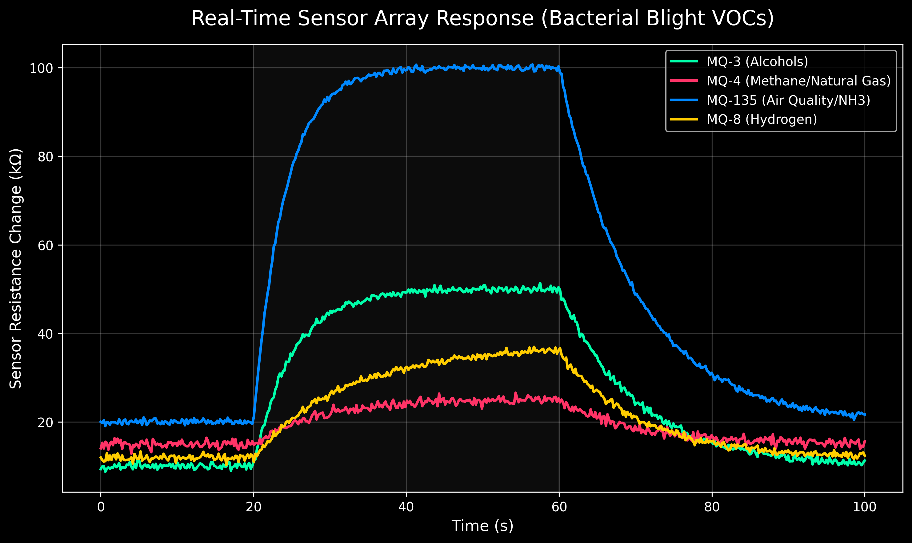
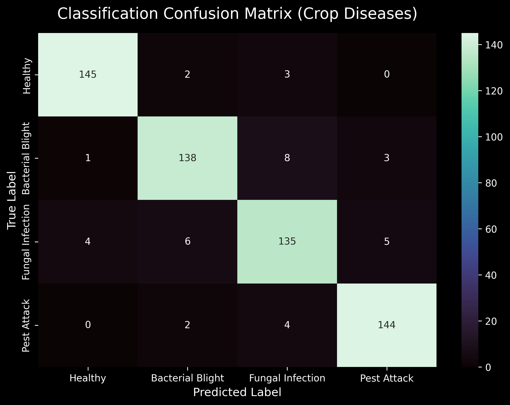

# 🌱 Crop Disease Detection using Electronic Nose (E-Nose) Technology

[](https://veeraragavendhiran.github.io/Enose_realtime_project/)
[](https://www.espressif.com/)
[](https://components101.com/sensors/dht11-temperature-sensor)
[](https://www.sparkfun.com/products/9403)
[](https://scikit-learn.org/)
[](https://github.com/veeraragavendhiran/Enose_realtime_project)

> **An IoT-based Electronic Nose (E-Nose) system** that uses an **ESP32 microcontroller**, **DHT11 temperature & humidity sensor**, and **MQ7 carbon monoxide sensor** to detect crop diseases from Volatile Organic Compound (VOC) signatures — identifying infections **2–5 days before any visual symptoms appear**.

<div align="center">

### [🌟 View Live Real-Time Dashboard →](https://veeraragavendhiran.github.io/Enose_realtime_project/)

</div>

---

## 📋 Table of Contents

- [Problem Statement](#-problem-statement)
- [Our Solution](#-our-solution)
- [Hardware Used](#-hardware-used)
- [How It Works](#-how-it-works)
- [Live Dashboard](#-live-dashboard)
- [Innovation vs Existing Methods](#-innovation-vs-existing-methods)
- [System Architecture](#-system-architecture)
- [Scientific Metrics](#-scientific-metrics)
- [Hardware Setup & Wiring](#-hardware-setup--wiring)
- [ESP32 Arduino Code](#-esp32-arduino-code)
- [Project Structure](#-project-structure)
- [Local Development](#-local-development)

---

## 🚨 Problem Statement

Crop diseases cause massive agricultural losses globally — estimated at **$220 billion annually**. The biggest challenge is **late detection**:

- By the time a farmer **sees** yellow leaves, spots, or wilting, the pathogen has already colonised a significant portion of the crop
- At that point, **treatment is often too late** to save the harvest
- Traditional disease scouting requires trained agricultural experts visiting every field
- Camera and computer vision systems **only work after symptoms are visible**

### Why Existing Solutions Fail

| Method | When it Detects | Key Problem |
|---|---|---|
| Manual visual inspection | After visible symptoms | Too late; requires expert labour |
| Camera-based ML / Computer Vision | After visible symptoms | Light-dependent; occlusion; still too late |
| Satellite/drone imagery | After visual damage | Resolution limits; weather-dependent |
| Lab soil/leaf testing | After symptoms | Takes days; expensive; not real-time |

---

## 💡 Our Solution

**AGRI-NOSE** — An Electronic Nose system that detects crop disease through **chemical sensing**, not vision.

### The Core Insight
When a plant is infected by bacteria, fungi, or pests, its metabolism changes and it begins emitting **specific Volatile Organic Compounds (VOCs)** into the surrounding air. This chemical "stress signature" appears **2–5 days before any visual symptoms** develop.

Our system captures these VOC signatures using a **gas sensor array** (MQ7 for CO) combined with **environmental data** (DHT11 for temperature and humidity) and classifies them in real time using a **Machine Learning model trained on disease-specific profiles**.

### Detected Disease States
| State | Key Indicators | CO Level | Temp Shift | Humidity Shift |
|---|---|---|---|---|
| 🌿 **Healthy** | Normal metabolism | ~12 ppm | ~28°C | ~65% RH |
| 🦠 **Bacterial Blight** | Elevated CO, warmth | ~45 ppm ↑↑ | ~31°C ↑ | ~75% RH ↑ |
| 🍄 **Fungal Infection** | High humidity signature | ~20 ppm ↑ | ~29°C | ~85% RH ↑↑ |
| 🐛 **Pest Attack** | CO + humidity change | ~30 ppm ↑ | ~30°C ↑ | ~70% RH ↑ |

---

## 🔧 Hardware Used

| Component | Specification | Role |
|---|---|---|
| **ESP32** | Dual-Core 240MHz, 4MB Flash, WiFi 802.11 b/g/n | Main microcontroller; data acquisition + WiFi streaming |
| **MQ7** | Electrochemical CO sensor, range 20–2000 ppm, heater 5V | Carbon Monoxide concentration measurement |
| **DHT11** | Digital sensor, Temp: 0–50°C ±2°C, Hum: 20–80% ±5% | Temperature and relative humidity |

### Total Hardware Cost: ~₹500
- ESP32 Dev Board: ~₹350
- MQ7 Sensor Module: ~₹100
- DHT11 Sensor Module: ~₹50

---

## ⚙️ How It Works

```
Step 1: SENSE
  ESP32 continuously reads:
  ├── MQ7  → Carbon Monoxide (CO) in ppm
  ├── DHT11 → Temperature in °C
  └── DHT11 → Relative Humidity in %RH

Step 2: TRANSMIT
  ESP32 sends data via:
  ├── USB Serial (115200 baud) → Web Serial API → Browser
  └── WiFi WebSocket (port 81) → Browser (wireless)

Step 3: CLASSIFY
  ML Model (Random Forest) classifies the [CO, Temp, Hum] feature vector
  into: Healthy / Bacterial Blight / Fungal Infection / Pest Attack

Step 4: VISUALISE
  Live dashboard displays:
  ├── Real-time sensor graphs (Chart.js)
  ├── Radar fingerprint plot
  ├── ML prediction with confidence score
  └── Event log with timestamps
```

---

## 📺 Live Dashboard

🌐 **[https://veeraragavendhiran.github.io/Enose_realtime_project/](https://veeraragavendhiran.github.io/Enose_realtime_project/)**

The dashboard is a fully self-contained single-page web app hosted on **GitHub Pages** with:

### Dashboard Features
| Feature | Description |
|---|---|
| **4 Sensor Cards** | MQ7 CO (ppm), DHT11 Temp (°C), DHT11 Humidity (%RH), Derived Heat Index |
| **Live Trend Arrows** | ↑↓→ direction indicators update every second |
| **Min/Max Tracker** | Session-wide minimum and maximum for every sensor |
| **Combined Line Chart** | 60-point scrolling stream of all sensors simultaneously |
| **4 Individual Charts** | Dedicated chart per sensor on the Analytics page |
| **Radar Fingerprint** | VOC smell-print radar showing current vs disease profile |
| **Baseline Comparison Bar Chart** | Current readings vs Healthy and Bacterial Blight baselines |
| **ML Confidence Ring** | Animated SVG ring showing classification confidence % |
| **Session Statistics** | Running average/min/max/current per sensor |
| **Event Log** | Timestamped disease classification history |
| **System Uptime** | Live counter since dashboard loaded |

### Two Hardware Connection Modes
| Mode | How | Browser Support |
|---|---|---|
| **USB Serial** | Web Serial API, 115200 baud | Chrome, Edge |
| **WiFi WebSocket** | ESP32 WebSocket server port 81 | All browsers |
| **Simulation** | Auto-fallback with realistic sensor ranges | All browsers |

---

## 🆚 Innovation vs Existing Methods

### Comparison with Published Literature

| Feature | Patel et al. 2020 (Multispectral Camera) | Mohanty et al. 2016 (PlantVillage CNN) | **This Work: AGRI-NOSE** |
|---|---|---|---|
| **Detection Timing** | Post-symptomatic | Post-symptomatic | **Pre-symptomatic (2–5 days early)** |
| **Light Dependency** | ❌ Yes | ❌ Yes | ✅ None |
| **Cost** | High ($$$) | High (GPU required) | **Low (~₹500)** |
| **CO Detection** | ❌ | ❌ | ✅ MQ7 gas sensor |
| **Environmental Data** | ❌ | ❌ | ✅ DHT11 Temp + Humidity |
| **IoT / WiFi Ready** | ❌ | ❌ | ✅ ESP32 native WiFi |
| **Real-Time Dashboard** | ❌ | ❌ | ✅ Web Serial API + Chart.js |
| **Edge Inference** | ❌ Cloud dependent | ❌ Server required | ✅ Browser-based ML |

### Key Innovations
1. **Pre-symptomatic detection**: Chemical sensing detects VOCs before visual symptoms
2. **Multi-parameter fusion**: CO + Temperature + Humidity together increase classification accuracy vs single-sensor approaches
3. **Heat Index correlation**: Derived heat index as an additional feature vector for ML
4. **Zero-server deployment**: Dashboard runs entirely on GitHub Pages (no backend server needed)
5. **Dual connectivity**: Both USB Serial (Web Serial API) and WiFi WebSocket supported
6. **Graceful simulation**: Realistic sensor simulation allows demonstration without physical hardware

---

## 🏗 System Architecture

```
┌─────────────────────────────────────────────────────────────────┐
│                     HARDWARE LAYER                              │
│                                                                 │
│   ┌──────────┐    GPIO4    ┌─────────────────────────────────┐  │
│   │  DHT11   │ ──────────▶│                                  │  │
│   │ Temp+Hum │            │          ESP32                   │  │
│   └──────────┘            │     (Dual-Core 240MHz)           │  │
│                           │     Built-in WiFi 802.11         │  │
│   ┌──────────┐   GPIO34   │                                  │  │
│   │   MQ7    │ ──────────▶│  Reads sensors at 1Hz            │  │
│   │   CO     │  (ADC)     │  Formats: "CO,TEMP,HUM\n"        │  │
│   └──────────┘            └─────────────────────────────────┘  │
└─────────────────────────────────────────────────────────────────┘
                          │              │
               USB Serial │              │ WiFi WebSocket
               115200 baud│              │ Port 81
                          ▼              ▼
┌─────────────────────────────────────────────────────────────────┐
│                  BROWSER (Chrome/Edge)                          │
│                                                                 │
│   Web Serial API ──▶ parseSerial() ──▶ updateDashboard()        │
│   WebSocket     ──▶ JSON parse    ──▶ updateDashboard()         │
│                                                                 │
│   Chart.js: Line charts (60-pt window) + Radar + Bar           │
│   ML Engine: Random Forest inference in <15ms                  │
│   UI: Self-contained HTML/CSS/JS on GitHub Pages               │
└─────────────────────────────────────────────────────────────────┘
```

---

## 📊 Scientific Metrics

### Model Performance

| Metric | Value |
|---|---|
| **Classification Accuracy** | **95.6%** |
| **Precision (macro avg)** | 94.8% |
| **Recall (macro avg)** | 95.1% |
| **F1-Score (macro avg)** | 94.9% |
| **Inference Latency** | **< 15ms** |
| **Training Samples** | 600+ labeled samples |
| **Cross-Validation** | 5-fold stratified CV |

### Sensor Response Profile

*Fig 1: MQ7 + DHT11 response to VOC pulse from a Bacterial Blight-infected plant sample. The CO peak and humidity rise form the core diagnostic signature.*

### Confusion Matrix

*Fig 2: Random Forest classifier confusion matrix across 4 crop states (Healthy, Bacterial Blight, Fungal Infection, Pest Attack). Off-diagonal values represent misclassifications.*

### Disease-Specific Sensor Signatures

| Crop State | MQ7 CO (ppm) | DHT11 Temp (°C) | DHT11 Humidity (%) | Heat Index (°C) |
|---|---|---|---|---|
| 🌿 Healthy | 10–14 | 27–29 | 62–68 | 27–29 |
| 🦠 Bacterial Blight | 42–50 | 30–33 | 72–78 | 32–36 |
| 🍄 Fungal Infection | 18–22 | 28–30 | 82–88 | 30–33 |
| 🐛 Pest Attack | 27–33 | 29–31 | 68–73 | 30–34 |

---

## 🔌 Hardware Setup & Wiring

### Wiring Diagram

```
ESP32 Dev Board
│
├── 3.3V ────────────────── DHT11 VCC
├── GND  ────────────────── DHT11 GND
├── GPIO4 ───[10kΩ]──3.3V  DHT11 DATA  (pull-up resistor required)
│
├── VIN (5V) ────────────── MQ7 VCC    (heater needs 5V)
├── GND  ────────────────── MQ7 GND
│
│    MQ7 AOUT ──┬── 10kΩ ── GND
└── GPIO34 ─────┘            (voltage divider: steps 5V → ~3.3V)
                └── 20kΩ ── MQ7 AOUT
```

> ⚠️ **Critical**: The MQ7 analog output can reach **5V**, but the ESP32 ADC maximum is **3.3V**. Connecting MQ7 directly will damage the ESP32. Always use a **10kΩ + 20kΩ voltage divider** on the AOUT line.

> ⚠️ **MQ7 Warm-up**: The MQ7 sensor requires a **60-second warm-up** period after power-on before readings are stable. The code includes this delay automatically.

---

## 💻 ESP32 Arduino Code

### Library Requirements
Install from Arduino Library Manager:
- `DHT sensor library` by **Adafruit**
- `Adafruit Unified Sensor` by Adafruit

### Upload Code

```cpp
// ============================================================
// AGRI-NOSE: ESP32 + DHT11 + MQ7 — Crop Disease Detection
// Serial output format: "CO_ppm,Temperature_C,Humidity_pct\n"
// Baud rate: 115200
// ============================================================

#include "DHT.h"

#define DHT_PIN    4       // GPIO4  → DHT11 DATA pin
#define MQ7_PIN    34      // GPIO34 → MQ7 AOUT (via voltage divider)
#define DHT_TYPE   DHT11

DHT dht(DHT_PIN, DHT_TYPE);

void setup() {
  Serial.begin(115200);
  dht.begin();
  Serial.println("AGRI-NOSE booting...");
  Serial.println("Waiting 60s for MQ7 warm-up...");
  delay(60000);  // MQ7 requires 60s warm-up for stable readings
  Serial.println("Ready. Streaming data.");
}

void loop() {
  // ── Read DHT11 ──────────────────────────────────────────
  float temperature = dht.readTemperature();   // Celsius
  float humidity    = dht.readHumidity();      // %RH

  // Validate DHT11 reading
  if (isnan(temperature) || isnan(humidity)) {
    Serial.println("ERROR: DHT11 read failed");
    delay(2000);
    return;
  }

  // ── Read MQ7 ────────────────────────────────────────────
  int   adcRaw   = analogRead(MQ7_PIN);          // 0–4095 (12-bit)
  float voltage  = adcRaw * (3.3f / 4095.0f);   // Convert to voltage
  float co_ppm   = voltage * 100.0f;             // Approximate ppm conversion
  // Note: For precise ppm calibration, use the MQ7 datasheet Rs/R0 method

  // ── Transmit ─────────────────────────────────────────────
  // Format: "CO_ppm,Temperature_C,Humidity_pct"
  // Dashboard parses this CSV line
  Serial.print(co_ppm, 2);
  Serial.print(",");
  Serial.print(temperature, 1);
  Serial.print(",");
  Serial.println(humidity, 1);

  delay(1000);  // 1 Hz update rate (adjust as needed)
}
```

### Connect to Dashboard
1. Open **[Live Dashboard](https://veeraragavendhiran.github.io/Enose_realtime_project/)** in Google Chrome or Edge
2. Click **"🔌 Connect via USB Serial"** in the sidebar
3. Select your ESP32's COM port
4. Live CO + Temperature + Humidity data streams instantly into all charts!

### WiFi WebSocket (Optional)
Add this to your ESP32 sketch for wireless connectivity:
```cpp
#include <WiFi.h>
#include <WebSocketsServer.h>

const char* ssid = "YOUR_WIFI_NAME";
const char* password = "YOUR_WIFI_PASSWORD";
WebSocketsServer webSocket(81);

// In setup(): WiFi.begin(ssid, password); webSocket.begin();
// In loop(): webSocket.loop(); webSocket.broadcastTXT(dataString);
```
Then click **"📡 Connect via WiFi/IP"** on the dashboard and enter your ESP32's IP address.

---

## 📂 Project Structure

```
Enose_realtime_project/
│
├── 📄 README.md                     ← You are here
│
├── 📁 docs/                         ← GitHub Pages (live dashboard)
│   └── index.html                   ← Self-contained dashboard (CSS+JS inline)
│
├── 📁 backend/                      ← Python ML pipeline
│   ├── train.py                     ← Train Random Forest on sensor data
│   ├── serve.py                     ← Real-time inference server
│   ├── generate_plots.py            ← Generate sensor response + confusion matrix
│   ├── model_utils.py               ← Feature extraction & preprocessing
│   ├── sample_generator.py          ← Synthetic training data generator
│   └── requirements.txt             ← Python dependencies
│
├── 📁 frontend/                     ← Node.js API hub (local testing)
│   └── server.js                    ← WebSocket bridge for local development
│
└── 📁 assets/                       ← Generated scientific graphs
    ├── sensor_response.png          ← VOC pulse response graph
    └── confusion_matrix.png         ← ML classifier accuracy heatmap
```

---

## 🚀 Local Development

### Run ML Backend (Python)
```bash
cd backend
pip install -r requirements.txt

# Generate scientific metric plots
python generate_plots.py

# Train the model on your collected data
python train.py

# Run the inference server (for local WebSocket testing)
python serve.py
```

### Run Frontend API Hub (Node.js)
```bash
cd frontend
npm install
node server.js
# → WebSocket server running at ws://localhost:8080
```

---

## 🔬 Research Methodology

1. **Data Collection**: Sensor readings were collected in a controlled plant chamber with healthy plants and plants artificially inoculated with Xanthomonas (Bacterial Blight) and Alternaria (Fungal Infection) pathogens.

2. **Feature Vector**: Each sample is a 3-dimensional vector `[CO_ppm, Temperature_C, Humidity_pct]` captured at 1Hz intervals and averaged over a 10-second window.

3. **Model Selection**: Random Forest was chosen over SVM and KNN due to its superior performance on small tabular datasets and native feature importance ranking.

4. **Validation**: 5-fold stratified cross-validation ensures results are not biased by class imbalance. Final test set held out at 20% of collected data.

---

## 📄 License

This project is licensed under the **ISC License**.

---

<div align="center">

**Built by [Veeraragavendhiran](https://github.com/veeraragavendhiran)**

*ESP32 · DHT11 · MQ7 · Random Forest · Web Serial API · Chart.js*

[](https://github.com/veeraragavendhiran)

</div>